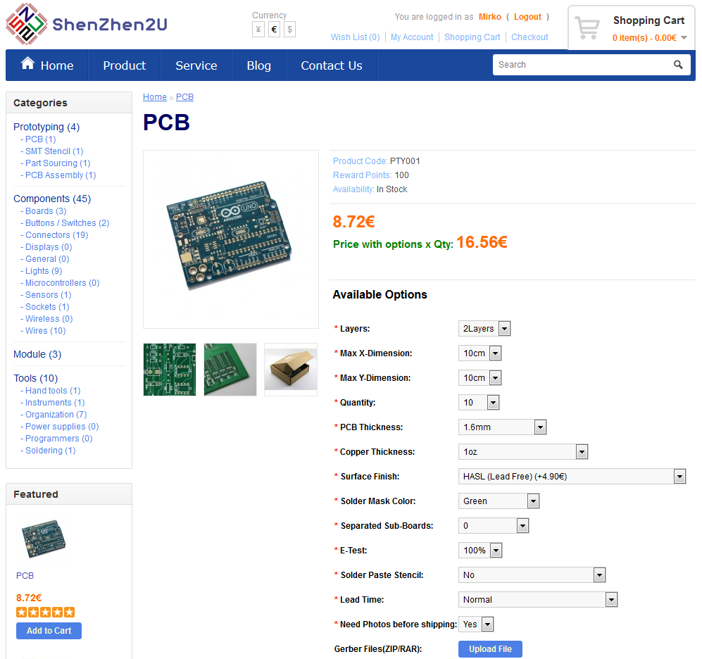

# BBBMINI-PCB

## License

 BBBmini by <a xmlns:cc="http://creativecommons.org/ns#" href="https://github.com/mirkix" property="cc:attributionName" rel="cc:attributionURL">Mirko Denecke</a> is licensed under a <a rel="license" href="http://creativecommons.org/licenses/by-sa/4.0/">Creative Commons Attribution-ShareAlike 4.0 International License</a>.

UNLESS OTHERWISE MUTUALLY AGREED TO BY THE PARTIES IN WRITING, LICENSOR OFFERS THE WORK AS-IS AND MAKES NO REPRESENTATIONS OR WARRANTIES OF ANY KIND CONCERNING THE WORK, EXPRESS, IMPLIED, STATUTORY OR OTHERWISE, INCLUDING, WITHOUT LIMITATION, WARRANTIES OF TITLE, MERCHANTABILITY, FITNESS FOR A PARTICULAR PURPOSE, NONINFRINGEMENT, OR THE ABSENCE OF LATENT OR OTHER DEFECTS, ACCURACY, OR THE PRESENCE OF ABSENCE OF ERRORS, WHETHER OR NOT DISCOVERABLE. SOME JURISDICTIONS DO NOT ALLOW THE EXCLUSION OF IMPLIED WARRANTIES, SO SUCH EXCLUSION MAY NOT APPLY TO YOU. EXCEPT TO THE EXTENT REQUIRED BY APPLICABLE LAW, IN NO EVENT WILL LICENSOR BE LIABLE TO YOU ON ANY LEGAL THEORY FOR ANY SPECIAL, INCIDENTAL, CONSEQUENTIAL, PUNITIVE OR EXEMPLARY DAMAGES ARISING OUT OF THIS LICENSE OR THE USE OF THE WORK, EVEN IF LICENSOR HAS BEEN ADVISED OF THE POSSIBILITY OF SUCH DAMAGES.

## Changelog

Rev 1.5
* Add second I2C port
* Add current and voltage sensing
* Fix HC-SR04 voltage divider

Rev 1.4
* Add connector for Ultra Sonic Range Finder HC-SR04.
* Add 5V pin to P10 (GPS / UART4)
* Add 5V pin to P4 (RC Input)
* Add voltage divider to P4 (RC Input) pin RC_IN (RCIN) to connect 5V signals to RC_IN (RCIN)
* Add MPU-9250 interrupt singal to PRU0

Rev 1.2
* Initial commit

## BOM

### PCB

This is an example how you can get 10 BBBMINI-PCBs for less than 30$.

Goto http://www.shenzhen2u.com/PCB 

Upload [bbbmini.zip](kicad/gerber/bbbmini.zip) to supplier.

Finish your order.

### IMU MPU-9250

Search for GY-9250 or MPU-9250 at [aliexpress](http://www.aliexpress.com/wholesale?SearchText=gy-9250)

### Baro MS5611

Search for GY-63 or MS5611 at [aliexpress](http://www.aliexpress.com/wholesale?SearchText=gy-63)

### Rangefinder HC-SR04

Search for HC-SR04, there are a lot of sellers.

## Connector

### P1 & P2
* 2.54mm pin header 3 x 12 straight or 90°
* 12 x RC out 3.3V

### P3
* 2.54 mm pin header 1 x 2 straight
* Close this jumper to connect 5V BBBMINI power supply to P1 / P2 RC out 5V

### P4 
* 2.54 mm pin header 1 x 4 straight
* RC receiver input. 
* For 5V RCIN signal R4 = 1kOhm and R5 = 2kOhm.
* For 3.3V RCIN signal R4 = 0Ohm / bridged and R5 = open / not equipped.

### P5
* 2.54mm pin header female 1 x 10 straight
* MPU-9250 breakout board

### P6
* 2.54mm pin header female 1 x 7 straight
* MS5611 breakout board

### P7
* 2.54mm pin header 1 x 5 straight
* UART4 port
* RX and TX 3.3V signals

### P8
* 2.54mm pin header 2 x 23 straight
* BeagleBone connector, pin header has to soldered on the back of the BBBMINI-PCB

### P9
* 2.54mm pin header 2 x 23 straight
* BeagleBone connector, pin header has to soldered on the back of the BBBMINI-PCB

### P10
* 2.54mm pin header 1 x 5 straight
* UART5 port (GPS)
* RX and TX 3.3V signals

### P11
* 2.54mm pin header 1 x 2 straight
* Connector for power supply. Use this connector to power the BeagleBone Black and BBBMIN-PCB. You can also use the BeagleBone Black power plug to power the BeagleBone Black and BBBMINI-PCB.

### P12
* 2.54mm pin header 1 x 7 straight
* External SPI Bus connector for additional hardware. 
* MOSI, MISO, SCLK and CS 3.3V

### P13
* 2.54mm pin header 1 x 2 straight
* CAN Bus interface

### P14
* 2.54mm pin header 1 x 2 straight
* Close this jumper to enable 120Ohm CAN Bus resistor.

### P15
* 2.54mm pin header 1 x 5 straight
* External I2C Bus  connector for additional hardware.
* SDA and SCL 3.3V

### P16
* 2.54mm pin header 1 x 3 straight
* Additional RC_1 ESC out connector for X-Quad configuration.
* RC_1 out 3.3V

### P17
* 2.54mm pin header 1 x 3 straight
* Additional RC_3 ESC out connector for X-Quad configuration.
* RC_3 out 3.3V

### P18
* 2.54mm pin header 1 x 3 straight
* Additional RC_4 ESC out connector for X-Quad configuration.
* RC_4 out 3.3V

### P19
* 2.54mm pin header 1 x 4 straight
* Ultrasonic Range Finder connector
* Connect HC-SR04 Range Finder here.  

### P20
* 2.54mm pin header 1 x 5 straight
* External I2C Bus  connector for additional hardware.
* SDA and SCL 3.3V

### P21
* 2.54mm pin header 1 x 5 straight
* Current and voltage sensing via Power Module
